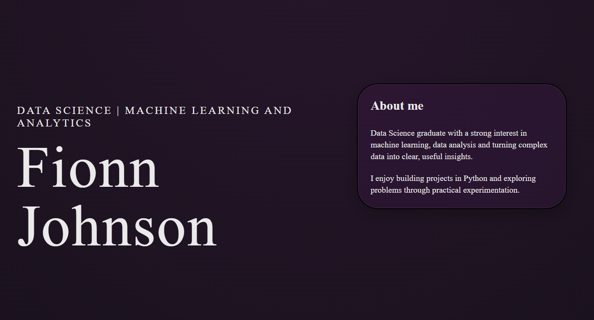

# Personal Portfolio Website

This repository contains the code for my personal portfolio. The website showcases my 
background in Data Science and Machine Learning, along with the personal projects I 
have completed using R and Python.

## Live Website

Visit the portfolio here:
https://fionnjohnson.github.io/portfolio/

For this project I used the following
- HTML
- CSS
- Responsive grid layout
- Git and Github for version control and deployment

## Future Improvements
- Additional personal projects
- Expanded project descriptions
- Interactive data visualisations 

## Author
Fionn Johnson

